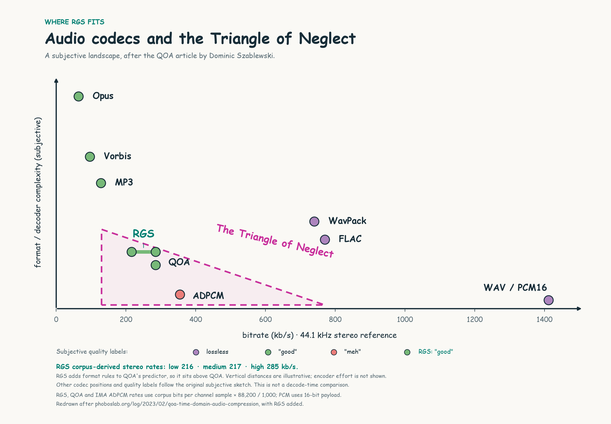
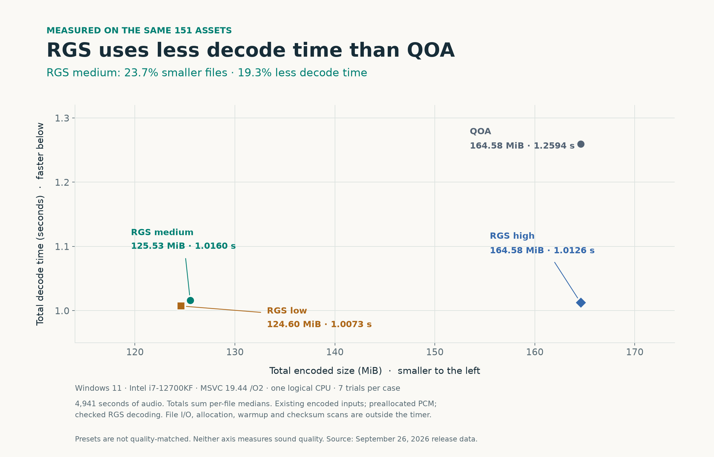

# RGS: small audio, simple decoding, built for games

*September 26, 2026 · Reverse Gravity*

A game can have hundreds of sounds ready to play, even when only a few are
audible. Keeping them all as PCM makes playback straightforward, but the
memory adds up. Compression saves space at the cost of work when a sound
needs to play.

RGS, short for **Reverse Gravity Signal**, is my approach to that tradeoff.
It's a small, lossy PCM16 format with an integer decoder, caller-owned buffers,
and a single-header C implementation.

On the current 151-file test corpus, the medium preset occupies **23.7% less
space than QOA** and takes **19.3% less decode time** in the measured Windows
build. I've also listened to the results, and I think RGS sounds good,
especially in the context of a game mix.

RGS builds on Dominic Szablewski's [Quite OK Audio](https://qoaformat.org/).
Its four-tap LMS predictor and quantizer tables come from QOA, and the derived
code retains its MIT attribution. His
[article introducing QOA](https://phoboslab.org/log/2023/02/qoa-time-domain-audio-compression)
explains the appeal of a simple time-domain codec for games. RGS explores
that same design space, adding two slice widths, channel-planar packing,
checked decoding, and integration with the Reverse Gravity libraries.

## Where RGS fits



*[Download SVG](assets/rgs-codec-landscape.svg) · [Download PNG](assets/rgs-codec-landscape.png)*

I added RGS to the **Triangle of Neglect** from
[the QOA article's opening chart](https://phoboslab.org/log/2023/02/qoa-time-domain-audio-compression).
Bitrate runs horizontally; conceptual format and decoder complexity runs
vertically, without a numerical scale. Opus, Vorbis, MP3, WavPack, and FLAC
keep their approximate positions from that subjective sketch.

The original green "good" and red "meh" labels are Szablewski's opinions.
I'd put RGS in the "good" category too. That's my subjective assessment;
the green circles joined by a line show its bitrate range.

The RGS range uses equivalent 44.1 kHz stereo rates derived from the corpus:
approximately **216 kb/s for low, 217 for medium, and 285 for high**. These
come from encoded bits per channel sample, normalized to stereo at 44.1 kHz;
they are not fixed preset bitrates. QOA and IMA ADPCM use the same storage
normalization, placing them at about 285 and 354 kb/s. PCM16 is 1,411.2 kb/s
before file headers. On that basis, RGS high sits alongside QOA in bitrate,
while medium and low move to the left.

RGS sits **above QOA** because its format and decoder have more cases to
implement: two slice widths, three frame modes, mode maps, and additional
padding and payload checks. Both use the same four-tap predictor, but RGS has
more format logic around it. The vertical gap is a qualitative judgment, not
a measured ratio. Faster decoding in a benchmark doesn't make a format simpler.

The encoder searches slice widths, measures error in its decoded output,
and retries difficult cases. That extra work happens
during asset preparation and is outside the chart's format/decoder axis.
I haven't benchmarked the transform or lossless codecs shown in this overview.

RGS belongs near QOA and ADPCM because a small predictor follows the waveform
and the file stores corrections to its predictions. Its smaller slices offer
lower bitrates by discarding more information. Whether that tradeoff works
depends on the asset.

The next plot compares measured file size and decode time:



*[Download SVG](assets/rgs-size-vs-decode.svg) · [Download PNG](assets/rgs-size-vs-decode.png) · [Exact chart data](assets/rgs-comparison-data.json)*

Lower and farther left means faster and smaller. All four points come from
the same release timing run. The presets aren't quality-matched. QOA's
published 2023 timings used
different hardware, audio, and tools, so they aren't mixed into this comparison.

## Predict a sample, store the correction

Uncompressed PCM16 uses sixteen bits for each channel's sample. At 44.1 kHz,
stereo consumes 176,400 bytes per second, or about 10.1 MiB per minute.

RGS predicts each sample from a history of four reconstructed samples. The
difference between that prediction and the source sample is the residual.
The encoder approximates it with a short code from a small table. A shared
scalefactor lets the table cover smaller or larger residuals.

The decoder follows a compact sequence:

```text
predict from four samples and four weights
look up the residual selected by the code and scalefactor
add the residual, then clamp to the PCM16 range
update the predictor weights and sample history
```

That loop needs no transform or entropy decoder. The encoder also reconstructs
the samples it selects: its predictor must follow exactly the history the
decoder will see, including quantization error and clamping.

RGS groups twenty samples from one channel into a slice. It has two storage
choices:

| Slice | Scalefactor | Residual codes | Padding | Total |
| --- | ---: | ---: | ---: | ---: |
| 3-bit codes | 4 bits | 20 × 3 bits | None | 8 bytes |
| 2-bit codes | 4 bits | 20 × 2 bits | 4 bits | 6 bytes |

Including the scalefactor and padding, the slices cost **3.2 and 2.4 bits per
channel sample**. The smaller representation saves a quarter of the slice
bytes by offering four residual choices instead of eight. The predictor
update stays the same.

A compressed frame holds up to 5,120 sample frames and stores each channel's
starting predictor state. All slices of one channel sit together in the
payload. A frame can use only 3-bit slices, only 2-bit slices, or a mixture
selected by compact per-channel bit maps. Those maps precede the channel
payloads. The decoder produces conventional interleaved PCM.

For full frames of 44.1 kHz stereo, the all-3-bit and all-2-bit representations
work out to about **285.0 and 214.4 kb/s**, including frame headers and predictor
state. File headers, mixed-mode maps, and partial final slices add overhead.
Medium and low choose representations adaptively; they are not fixed-bitrate
presets. The current `target_kbps` option caps the quality choice rather than
enforcing a requested bitrate.

The [companion specification article](rgs-specification.md) shows every byte
and bit, including the exact integer arithmetic and a complete example file.

## Spend effort when preparing the asset

The format fixes what the bytes mean, leaving the encoder free to search for
a better way to represent the source. This is a useful place to spend time
when preparing assets.

An initial choice of predictor state and slice width can work across most of
a recording and still produce large errors in a difficult passage. A good
average across the whole corpus can hide those failures.

The current encoder measures error in the PCM reconstructed from its actual
packed output. For difficult frame/channel combinations, it tries alternative
starting predictor states and permitted width choices. It keeps a candidate
only when that frame/channel's squared error improves. The chosen state is
already stored in the frame, so the decoder needs no new heuristic or format
version to use it.

The corpus's `ambience_forest_birds_03.wav` shows the effect. Its medium-preset
whole-file SNR improved from **2.87 to 19.15 dB**. That's a substantial
numerical improvement in a troublesome asset, though it isn't a listening-test
result and some local errors remain. The
[quality evaluation](../results/2026-09-26-quality/README.md) includes the
remaining flagged frames and cases where local error increased.

The extra search costs encoding time. A paired comparison using a single
trial measured about 13–17% more total encoding time, depending on preset,
with less than 0.4% total size growth. That was a separate screening run;
the decode comparison uses seven trials per case. The cost belongs in asset
preparation, outside the audio callback.

## What the measurements say

The test corpus contains 151 files: 59 mono and 92 stereo, covering effects,
ambience, speech, and music. Together they contain 4,941.45 seconds of audio.
Every codec receives the same prepared PCM. Input above 44.1 kHz is resampled
with libsoxr VHQ before encoding.

The decode comparison ran on Windows 11 with an Intel Core i7-12700KF and
MSVC 19.44 `/O2`, pinned to one logical CPU. Each reported total sums the
per-file median of seven trial batch means. The encoded inputs already exist
and the output buffers are preallocated. The timer includes RGS header and
frame validation, as well as QOA header parsing. File I/O, allocation, warmup,
and checksum scans stay outside it.

| Codec | Encoded MiB | Decode seconds | Median SNR, dB |
| --- | ---: | ---: | ---: |
| RGS high | 164.58 | 1.0126 | 35.78 |
| RGS medium | 125.53 | 1.0160 | 28.87 |
| RGS low | 124.60 | 1.0073 | 27.38 |
| QOA reference | 164.58 | 1.2594 | 35.78 |
| WAV IMA ADPCM | 204.55 | — | 33.37 |
| PCM16 WAV | 814.91 | — | Exact |

*Size includes file overhead. SNR is the median of finite per-file values,
not a perceptual score. PCM and IMA are storage/quality references on the same
prepared inputs; their older timing run is excluded here. RGS high has four
more header bytes per file than QOA, a 604-byte corpus difference hidden by
the rounded MiB figures. Matching median SNR does not imply matching PCM.*

RGS takes **19.3–20.0% less total decode time** than QOA in this build.
Separating the corpus by channel count, mono takes 10.5–11.9% less time and
stereo takes 19.5–20.1% less. These results apply to the compiled implementations
on this machine; ARM and console targets need their own measurements.

Several implementation choices contribute to that result. The codec has
dedicated mono handling and organizes its loops differently for different
compilers. On MSVC x64, the mono path uses scalar state and four-sample
unrolling; other compilers retain an array form they can optimize differently.
The comparison doesn't isolate channel layout, byte order, or any one
arithmetic change as the cause of the full speed difference. The earlier
[decoder profiling results](../results/2026-09-26-mono/README.md) document the
optimization measurements separately.

Medium reduces size by 23.7% relative to QOA and 38.6% relative to this IMA
encoding. Low saves only another 0.93 MiB across the corpus, with a lower
median SNR. I'd start an evaluation with medium and try low where the extra
saving matters.

The complete [release measurements](../results/2026-09-26-release/README.md),
[quality results](../results/2026-09-26-quality/README.md), and
[reproduction instructions](../benchmarks.md) are available alongside the code.
The graph's [data file](assets/rgs-comparison-data.json) records exact values,
formulas, and source hashes.

## What this means inside a game

The application owns the compressed input, PCM destination, and playback
queues. The codec allocates no memory internally. Its runtime header depends
only on `rg_core`'s `rg_defs.h`; SDL, GUI, text, and resampling libraries belong
to the optional tools.

For a long sound, a decoder worker can feed a PCM ring:

```text
resident RGS bytes -> decoder worker -> PCM ring -> audio callback / mixer
```

The worker stays ahead of playback so the callback can consume ready samples.
For short effects used repeatedly, decoding once and sharing the PCM may be a
better tradeoff than allocating a streaming ring for every voice. A frame of
stereo PCM holds up to 20,480 bytes; four full frame slots consume 81,920 bytes
per voice before other state.

RGS supports one through eight channels and stored rates up to 44.1 kHz.
Its sequential API reads a complete resident compressed buffer and can reset
to the beginning. If you need incremental file input, seek indexes, custom
loop regions, or speaker-layout metadata, the outer container or application
supplies them. The [streaming guide](../streaming.md) covers ownership and
callback details.

Decoder throughput is one part of a game's audio budget. Mixing, resampling,
scheduling, and device behavior also take time. Measure the full playback
path on your target platform with representative assets before deciding how
to use the format.

## Listen to the tradeoff

The chart's "good" rating reflects my own listening. Numerical checks help
find difficult cases, but they can't establish perceptual transparency.
The preset names don't guarantee that high, medium, and low will rank in
that order for every signal, either.

The optional A/B player lets you compare the prepared WAV reference with an
RGS medium encoding on the same playback timeline. After building the player as
described in the [README](../../README.md#tools), run this from the repository
root in Command Prompt:

```bat
set "PATH=%CD%\build\deps\install\bin;%PATH%"
rgs_player.exe path\to\audio-folder
```

The player reads WAV input and encodes it in memory. **Tab** switches between
the reference and RGS, **Space** pauses, and **Left/Right** changes tracks.
The folder scan is nonrecursive, and the `PATH` change lasts only for that
Command Prompt session.

Try the sounds that matter in your game: a quiet ambience, a sharp impact,
dialogue, and exposed music. Compare at the same volume, then listen again
in the mix. Use that comparison to decide whether the smaller files are
worth the quality tradeoff for those assets.

To integrate RGS, start with [RGS v1, byte by byte](rgs-specification.md)
and the [normative format specification](../rgs_format.md). The reference
codec is [one C header](../../src/rg_rgs.h).
